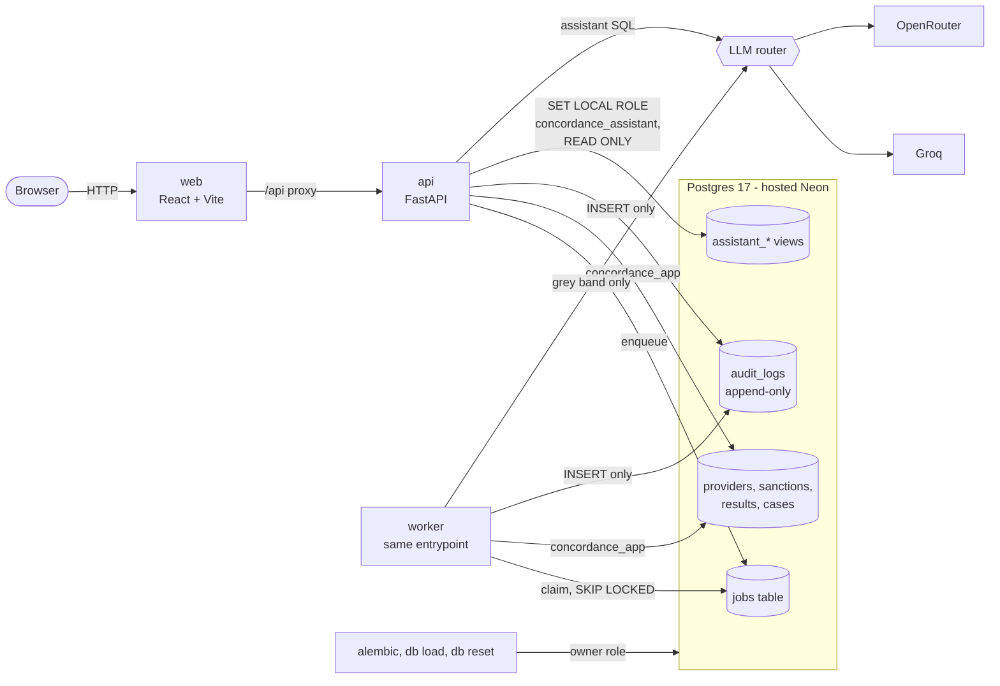

# Concordance

**Reconciling healthcare providers against sanction and exclusion lists, when up to
90% of the data on both sides is wrong.**

That constraint is the whole problem. A fuzzy-match threshold with an LLM behind it
handles clean data and produces confident nonsense on dirty data, with no way to tell
which it is doing. Concordance answers it with a Fellegi–Sunter probabilistic
record-linkage engine whose field weights are *learned* by Expectation-Maximization
rather than hand-tuned, whose output is a calibrated posterior probability rather than
a score, and which sends only the genuinely uncertain cases to a language model — then
proves each of those claims with a measurement you can reproduce.

At 50% corruption it holds an F1 of **0.945** where hand-tuned fuzzy matching manages
**0.305**. When it says 0.90, it means it: holdout Expected Calibration Error is
**0.037** after isotonic calibration. Every decision it has ever made can be replayed
bit-for-bit, and any two runs can be diffed to show exactly which decisions a config
change moved.

---

## Quick start

Prerequisites: **Python 3.12**, **Node 22**, and a **Postgres 17** database you own
(the project is developed against a hosted [Neon](https://neon.tech) branch — nothing
needs installing locally). There is no container runtime anywhere in this project.

`make` is optional. Every target is a thin wrapper over `tasks.py`, so on a machine
without it — Windows ships none — `make up` is `python tasks.py up`, and `make up
DETACH=1` is `python tasks.py up DETACH=1`.

**Once per database, before the first start**, as the owning role. The application
connects as a second role that does not own the tables, because an owner can never be
revoked from its own table and `audit_logs` is meant to be append-only. Create it
before the migrations run: they grant it its privileges, and skip the grants if it
does not exist yet.

```sql
CREATE EXTENSION IF NOT EXISTS pg_trgm;
CREATE ROLE concordance_app LOGIN PASSWORD '<choose one>';
GRANT CONNECT ON DATABASE <your database> TO concordance_app;
GRANT USAGE ON SCHEMA public TO concordance_app;
```

`DATABASE_URL` is the owner, used for migrations and nothing else routine;
`APP_DATABASE_URL` is `concordance_app`, and is what the API and worker use.

**A second database** — for the demo, or anything destructive — needs no second
checkout. Create it (owned by the same owner role, not by one of the application
roles: on Postgres 15+ the database owner also owns the `public` schema), run the
setup SQL above in it, and put its two URLs in `.env.demo`. Then
`CONCORDANCE_ENV_FILE=.env.demo` in front of any command — `make demo`, `make up` —
layers that file over `.env` for that command only. Any `.env.*` other than
`.env.example` is gitignored.

```
git clone <this repository>
cd provider-reconciliation

py -3.12 -m venv .venv
.venv\Scripts\pip install -e "backend[all]"

cd frontend && npm ci && cd ..

copy .env.example .env          # then fill in DATABASE_URL, APP_DATABASE_URL, JWT_SECRET

make up
```

`make up` is the one command. It runs a preflight, applies the migrations, and starts
the API, the job worker and the web app as three labelled log streams in one terminal.
Ctrl-C stops all three, and stops them gracefully: the API drains its requests and the
worker finishes the job in hand. `make up DETACH=1` runs the same thing in the
background, `make logs` follows it, and `make down` stops it the same way.

If anything is missing, the preflight says so before a single process is started:

```
ok   environment - 3 required keys set
ok   database - both roles answer
ok   migrations - not checked - upgraded to head next
ok   port 8000 - api - free
ok   port 5173 - web - free
ok   web dependencies - node_modules present
preflight passed
```

Then, in another terminal:

```
make seed CORRUPTION=0.5    # 50k synthetic providers, 5k sanction records, ground truth
make load                   # into Postgres
make fit                    # EM fit, isotonic calibration, threshold selection
make demo                   # the curated demo state
```

The web app is on <http://localhost:5173>, the API's docs on
<http://localhost:8000/docs>.

**No database?** Stages up to the engine need none. `make seed`, `make fit`, `make eval`
and `make sweep` work against Parquet files alone and write a self-contained HTML
report to `reports/`.

---

## Why this is not just a fuzzy matcher

A fuzzy matcher compares two strings and gives you a number between 0 and 1. That
number is not a probability, it cannot be calibrated, and it has no way to express what
it does not know. Five things here follow from taking that seriously.

**The weights are learned, not chosen.** Fellegi–Sunter asks a different question than
string similarity does: not "how alike are these two surnames?" but "how much evidence
is it that two records agree on *this* surname, given how rare it is?" Agreement on a
rare surname is strong evidence; agreement on a common one is nearly none, and a
hand-tuned weight cannot tell them apart. The m- and u-probabilities behind that
calculation are fitted by Expectation-Maximization on unlabelled data. Learned weights
beat the hand-tuned baseline by a margin that widens as the data gets worse — which is
exactly the direction that matters.

**The confidence is calibrated, and the calibration is measured.** The posterior goes
through isotonic regression fitted on a holdout, and the reliability diagram is
published rather than asserted. Expected Calibration Error falls from 0.087 to 0.037
for the individual model and from 0.032 to 0.020 for the organization model.

**The LLM is routed by cost, not by vibes.** Because confidence is calibrated, the grey
band between the auto-accept and auto-reject thresholds is a defensible boundary rather
than a guess, and only pairs inside it reach a model. The Lab prices that decision
against an LLM-on-everything baseline: model calls, tokens and dollars on one side, F1
with a bootstrap interval on the other.

**Every decision replays.** A run is pinned to a data snapshot hash, a scoring-config
version, an engine version and a prompt version, and every model call is cached by
content hash. Any historical decision can be re-derived exactly, and any two runs can be
diffed: which decisions changed, and which field moved them.

**The feedback loop actually loops.** Reviewer verdicts become labels; a retune refits on
them and re-optimizes thresholds. It is gated: a retune that buys precision with review
load is refused, and with 3% reviewer error the gate refuses every round — which is the
honest result, and the reason the gate exists.

---

## Measured results

50,000 providers × 5,000 sanction records, ten corruption levels, on one machine.

### Robustness — F1 against the corruption dial

| corruption | deterministic | fuzzy (hand-tuned) | probabilistic (EM) |
|---:|---:|---:|---:|
| 0.0 | 0.549 | 0.503 | **0.999** |
| 0.5 | 0.402 | 0.305 | **0.945** |
| 0.9 | 0.303 | 0.185 | **0.886** |

The naive strategies do not degrade gracefully; they collapse. Thirty cells in 221 s.

### Calibration — Expected Calibration Error on the holdout

| model | before isotonic | after |
|---|---:|---:|
| individual | 0.087 | **0.037** |
| organization | 0.032 | **0.020** |

Measured on the best candidate per record, which is the quantity thresholds are
actually applied to. Calibrating over every candidate pair would give a far
better-looking number and mean nothing, because most pairs are obvious non-matches
that no decision is ever made about.

### Blocking — recall against cost

| | corruption 0.5 | corruption 0.9 |
|---|---:|---:|
| Blocking recall | **0.9962** (4184/4200) | **0.9819** (4124/4200) |
| Mean candidates/record | 43.2 | 41.5 |
| Index build, 50k providers | 8.17 s | 8.48 s |
| Query, 5,000 records | 11.3 s | 11.0 s |

### Feedback loop — F1 across simulated review rounds

| round | 1 | 2 | 3 | 4 |
|---|---:|---:|---:|---:|
| F1 | 0.906 | 0.931 | 0.945 | 0.947 |
| grey band | 20.9% | — | — | 14.0% |

With 3% reviewer error injected, the activation gate refuses every round and the curve
stays flat at 0.906.

---

## Architecture

```
                    ┌──────────────┐
   sanction file ──▶│  two-phase   │──▶ column mapping, then ingest
                    │    upload    │
                    └──────┬───────┘
                           ▼
  ┌────────────────────────────────────────────────────────┐
  │  matching/        normalization → NPI check → blocking  │
  │                   → comparison vectors → Fellegi-Sunter │
  │                   → isotonic calibration → thresholds   │
  └───────────┬───────────────────────────────┬────────────┘
              │ accept / reject               │ grey band only
              ▼                               ▼
      ┌───────────────┐              ┌──────────────────┐
      │ match_results │              │  LLM adjudicator │
      │   (audited)   │◀─────────────│  router: groq →  │
      └───────┬───────┘              │  openrouter,     │
              │                      │  cached by hash  │
              ▼                      └──────────────────┘
      ┌───────────────┐
      │ review queue  │──▶ analyst verdict ──▶ labels ──▶ retune (gated)
      └───────────────┘
```

At runtime:



The owner role runs migrations and the two commands that truncate, and nothing
else. The app role cannot update or delete an audit row, and the assistant's
role can read five views and nothing else. The only outbound network calls are
to the two LLM providers, and a run with `LLM_ENABLED=false` makes none.

Three processes, started together by `make up`:

- **api** — FastAPI, JWT access + refresh, argon2 password hashing, role-based access.
- **worker** — the same entrypoint module with different arguments. Claims jobs from a
  Postgres queue (not Celery: the job table is already transactional with the data the
  jobs touch, and one fewer moving part is worth more than the throughput nobody needs
  here).
- **web** — React 19 + Vite + TypeScript.

---

## Layout

| Path | What is in it |
|---|---|
| `backend/src/concordance/matching/` | The engine: normalization, NPI, blocking, comparators, Fellegi–Sunter, calibration |
| `backend/src/concordance/llm/` | Provider router, response cache, prompts, schema-checked adjudication |
| `backend/src/concordance/api/` | FastAPI application, auth, the review workflow |
| `backend/src/concordance/lab/` | The sweep, the LLM cost experiment, the feedback simulation |
| `backend/src/concordance/assistant/` | Constrained natural-language → SQL, with a parser-level guard |
| `backend/src/concordance/ops/` | The startup preflight |
| `frontend/` | React application and its Playwright end-to-end suite |
| `scripts/supervise.py` | The launcher behind `make up` |

## Documentation

| Document | What it covers |
|---|---|
| [`docs/matching_engine.md`](docs/matching_engine.md) | The engine, written for someone who has never seen Fellegi–Sunter: level tables, the EM derivation, the guard rails, and why learned weights beat tuned ones |
| [`docs/orchestration.md`](docs/orchestration.md) | Runs, the Postgres job queue, replay and diff |
| [`docs/lab.md`](docs/lab.md) | The two experiments, the cost estimator, and what it refuses to estimate |
| [`docs/assistant.md`](docs/assistant.md) | The natural-language query guard and what it rejects |
| [`docs/feedback_loop.md`](docs/feedback_loop.md) | Labels, retuning, the activation gate, and what label noise does |
| [`docs/blocking.md`](docs/blocking.md) | Candidate generation and its measured recall |
| [`docs/scenario_catalogue.md`](docs/scenario_catalogue.md) | The synthetic dataset and its eight corruption scenarios |
| [`docs/data_dictionary.md`](docs/data_dictionary.md) | Every table and column |
| [`docs/PLAN.md`](docs/PLAN.md) · [`docs/CHECKLIST.md`](docs/CHECKLIST.md) | Architecture, the staged build plan, and the gate each stage had to pass |

## Common commands

```
make up            start api, worker and web      make down     stop a detached start
make preflight     check before starting          make ps       what is running
make seed          generate a synthetic dataset   make load     load it into Postgres
make fit           EM fit and calibration         make eval     standalone HTML report
make sweep         the corruption sweep           make reset-db empty the database
make test          the whole suite                make cov      with coverage
make lint          ruff                           make typecheck mypy
make e2e           the Playwright walkthrough
```

## Licence

MIT.
